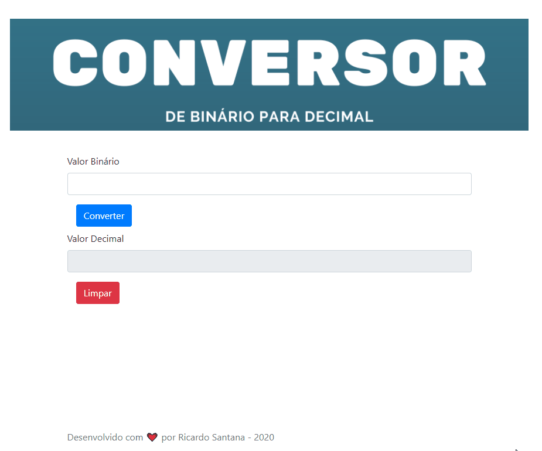

# Angel Barbershop

  
## :superhero: Conversor de Binário para Decimal

Este repositório contém um pequeno projeto que consiste em uma página web com um formuário
para que o usuário digite um valor em base binária e seja convertido para base decimal.
  
## :clipboard: Sobre o projeto

O projeto feito utlizando "Vanilla JS", ou seja, JavaScript puro.
Utilizei também:
* [Bootstrap](https://getbootstrap.com/)
* [Reset CSS](https://meyerweb.com/eric/tools/css/reset/)
 
:grey_exclamation: Não utilizei os padrões e boas práticas, se trata apenas de um exercício. 

## :desktop_computer: Pré-requisitos

* Um navegador web

## :arrow_forward: Como executar o projeto

Basta clicar no arquivo index.html

## Autor :person_with_blond_hair:

Feito com ❤️ por Ricardo Santana 👋🏽 Entre em contato!

* [linkedin.com/in/slopesricardo/](https://www.linkedin.com/in/slopesricardo/)
* [slopes.ricardo@gmail.com](mailto:slopes.ricardo@gmail.com)

## :pencil2: Licença

Este projeto sob licença MIT.

